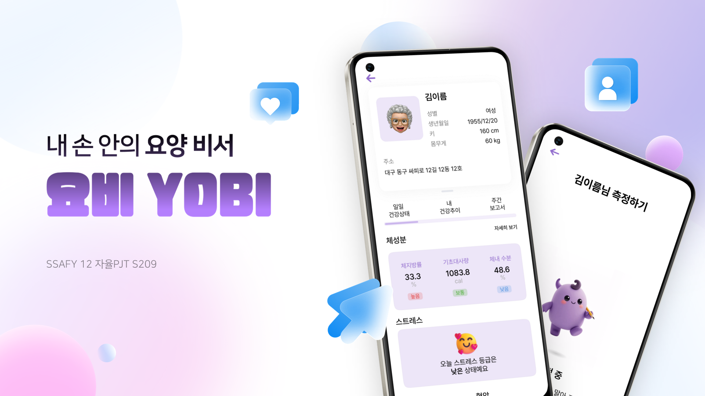
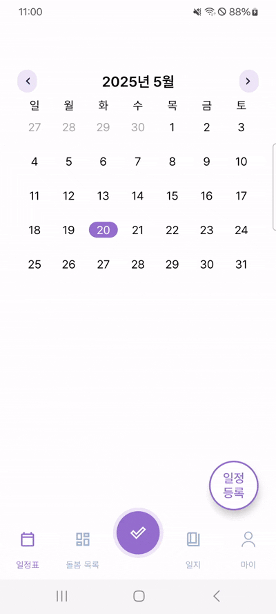
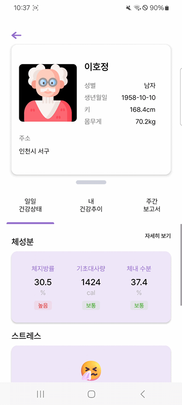
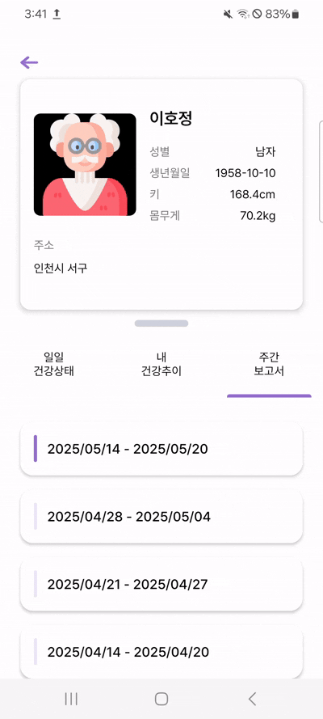
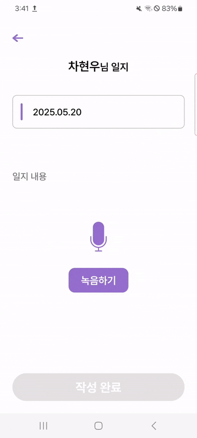

<div align="center">
  <h1>🤖 내 손 안의 요양 비서, 요비 (YOBI)</h1>
  <p>요양보호사를 위한 디지털 돌봄 기록 솔루션</p>
</div>

<br/>

<div align="center">
  <!-- 프로젝트 대표 이미지 -->
  
</div>

<br/>

---

## ✍️ 프로젝트 소개

### 프로젝트 배경

요양보호사들은 어르신을 돌보는 과정에서 다양한 정보를 기록하고 전달해야 합니다. 그러나 아날로그 방식의 수기 기록, 비표준화된 커뮤니케이션 방식, 주관적인 해석이 더해져 돌봄 정보에 혼선이 생기고 있습니다. 

이로 인해 보호자, 의료진, 요양기관 간의 정보 공유에 어려움이 발생하며, 이는 곧 어르신의 건강 상태 파악 및 서비스의 질 저하로 이어질 수 있습니다.

**요비**는 이러한 문제를 해결하기 위해 개발된 디지털 요양 기록 비서 서비스입니다. 음성 인식, OCR, 건강 상태 측정, AI 리포트 등의 기능을 통해 요양 기록 과정을 디지털화하고, 보다 효율적이고 신뢰할 수 있는 요양 환경을 조성하는 것을 목표로 합니다.

### 문제점 해결

- **수기 기록의 한계** → 음성 인식 및 자동 텍스트 변환 기능을 통해 쉽게 기록 가능  
- **정보 전달의 불일치** → AI 리포트 요약 및 데이터 시각화를 통해 정확한 정보 전달  
- **주관적인 감정 표현** → 욕설 및 사견 필터링 기능으로 공식적이고 중립적인 기록 유도  
- **일정 관리의 어려움** → OCR을 활용한 종이 일정표 자동 디지털화 기능 제공  
- **객관적 건강 파악의 어려움** → 디바이스 연동을 통한 **건강 상태 측정 기능** 제공  

## 🧩 주요 기능

### 🗓️ 일정표 OCR 기능
- 수기 일정표를 사진 촬영하면 자동 인식 및 등록
- 달력 UI로 일정 확인 및 관리



### 📊 건강 모니터링 대시보드
- 혈압, 혈당, 체온 등 건강정보 시각화
- 일간/주간 단위 변화 추이 확인 가능



### 🧠 AI 주간 리포트 자동 생성
- 건강 변화 + 활동 일지를 요약
- 특이사항 포함 관리자 보고서 자동 작성

### 🧾 OpenAI 기반 요약 기능
- 일별 기록을 AI가 주간 단위로 요약
- 보호사와 관리자가 전체 흐름 쉽게 파악



### 🎤 음성 기반 일지 작성
- 보호사의 음성을 자동 텍스트화
- 날짜/어르신 기준 자동 정리
- 비속어, 사견 자동 필터링




### 🩺 건강 상태 측정 기능  
- Fitrus 디바이스를 통해 어르신의 체성분, 심박수, 혈압 등의 데이터를 실시간으로 측정  
- 측정된 수치는 자동 저장되어 건강 대시보드 및 리포트에 반영


---

## 🗓️ 프로젝트 일정

| 단계           | 기간                  | 주요 활동                     |
|----------------|-----------------------|-------------------------------|
| 기획           | 2025.04.07 ~ 04.20     | 요구사항 도출, 서비스 컨셉 정의 |
| 디자인 및 설계 | 2025.04.21 ~ 05.02     | UI/UX 설계, 프로토타입 작성     |
| 개발           | 2025.04.28 ~ 05.19     | 앱 및 서버 개발                 |
| 테스트         | 2025.05.18 ~ 05.21     | 기능 테스트 및 오류 수정         |
| 배포           | 2025.05.22            | 최종 릴리즈 및 결과 보고         |

---

## ⚙️ 기술 스택

| 분류       | 기술 스택 |
|------------|------------|
| **Android** |   |
| **Backend** |     |
| **AI** |      |
| **Database** |   |
| **DevOps** |     |
| **협업 도구** |     |

---

## 📱 Android 패키지 구조

```
   └─myapplication
            ├─base
            ├─data
            │  ├─dto
            │  │  ├─model
            │  │  ├─request
            │  │  └─response
            │  ├─local
            │  ├─remote
            │  └─repository
            ├─di
            ├─network
            ├─ui
            │  ├─care
            │  │  ├─carelist
            │  │  ├─caremain
            │  │  ├─daily
            │  │  ├─dailydetail
            │  │  ├─report
            │  │  ├─reportdetail
            │  │  └─seven
            │  ├─measure
            │  │  ├─bluetoothguide
            │  │  ├─deviceconnect
            │  │  ├─measureguide
            │  │  ├─measureitem
            │  │  ├─measureloading
            │  │  ├─measureresult
            │  │  ├─measuretarget
            │  │  └─measuretransition
            │  ├─mypage
            │  │  ├─changePassword
            │  │  ├─mypage
            │  │  └─policy
            │  ├─schedule
            │  │  ├─manualschedule
            │  │  ├─photoschedule
            │  │  └─schedule
            │  └─visitlog
            │      ├─diarydetail
            │      ├─visitloglist
            │      └─visitwrite
            └─util
```

## 🖥️ BackEnd 패키지 구조

```
yobi
├─config
├─domain
│  ├─clients
│  │  ├─controller
│  │  ├─entity
│  │  ├─repository
│  │  └─service
│  ├─measures
│  │  ├─controller
│  │  ├─entity
│  │  ├─Enum
│  │  ├─helper
│  │  ├─Mapper
│  │  ├─repository
│  │  └─service
│  ├─report
│  │  ├─controller
│  │  ├─entity
│  │  ├─repository
│  │  └─service
│  ├─schedules
│  │  ├─controller
│  │  ├─entity
│  │  ├─repository
│  │  └─service
│  └─users
│      ├─controller
│      ├─entity
│      ├─repository
│      └─service
├─DTO
│  ├─requestDTO
│  └─responseDTO
├─exceptionFinal
└─Mapper
```


## 🤖 AI 패키지 구조

```
AI/
├── app/
│   ├── main.py
│   ├── ai_model/
│   │   └── download_models.py
│   ├── models.py
│   ├── schemas/
│   │   └── health_data.py
│   ├── batch/
│   │   ├── batch_generator.py
│   │   ├── batch_retry.py
│   │   ├── batch_scheduler.py
│   │   ├── batch_runner.py
│   │   └── manual_report.py
│   ├── core/
│   │   ├── config.py
│   │   └── database.py
│   └── service/
│       └── health_data_service.py
├── requirements.txt
├── .env
└── README.md
```

## 🧾 OCR 패키지 구조
```
OCR/
├── app/
│   ├── __init__.py
│   ├── main.py
│   ├── core/
│   │   ├── database.py
│   │   └── redis_client.py
│   ├── models/
│   │   ├── __init__.py
│   │   └── schemas.py
│   ├── router/
│   │   ├── __init__.py
│   │   └── ocr_router.py
│   ├── service/
│   │   ├── __init__.py
│   │   └── ocr_service.py
│   ├── utils/
│   │   ├── __init__.py
│   │   ├── goolgle_ocr.py
│   │   └── vision_utils.py
├── .gitignore
├── requirements.txt
├── Dockerfile
├── main.py
├── ocr_response_debug.json
└── README.md
```


## 팀원 소개

|[이서현](https://github.com/kizizip)|[이문경](https://github.com/MunGyeong-Lee)|[차현우](https://github.com/SWisdom1108)|[민수현](https://github.com/nuyhus-m)|[박진현](https://github.com/PJinhyeon)|[이호정](https://github.com/HoJungL)|
|------|---|---|---|---|------|
|||||||

